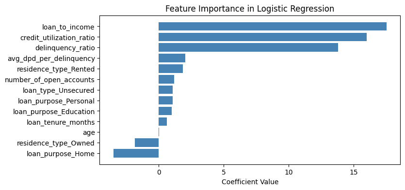
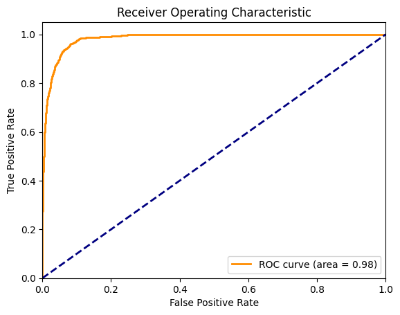
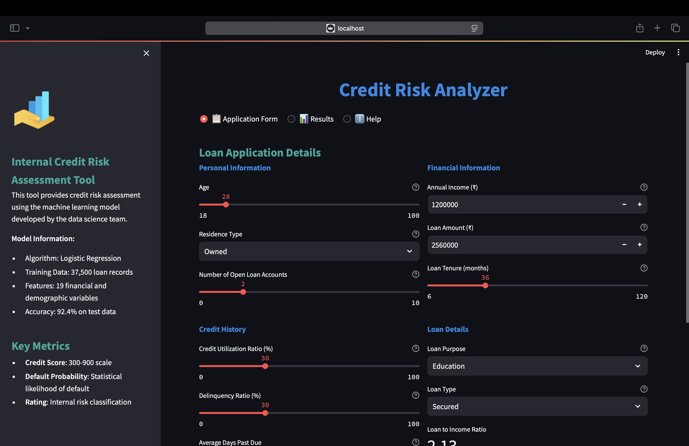
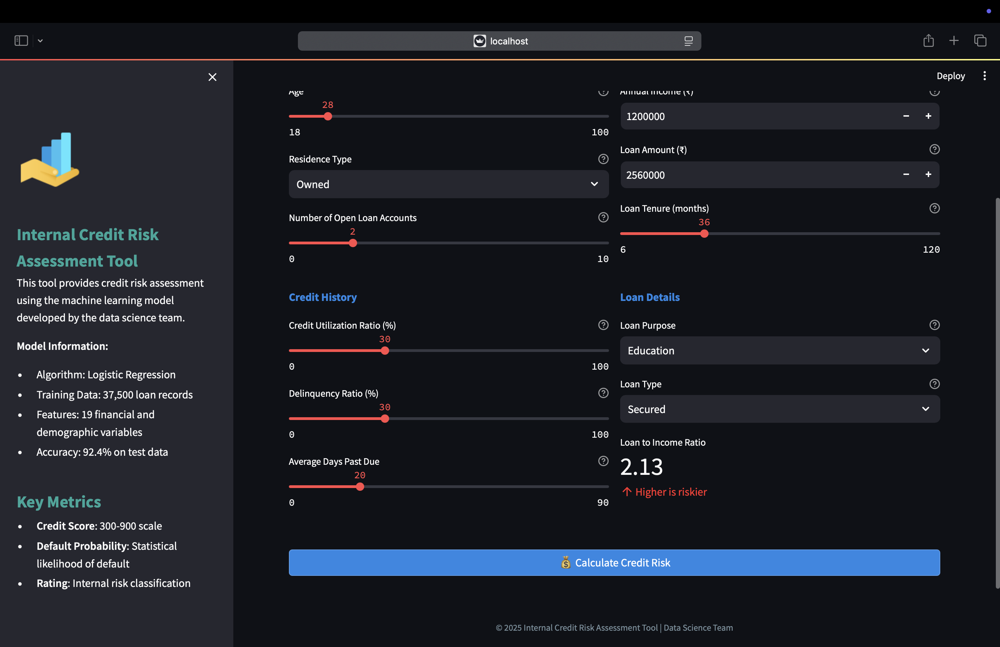
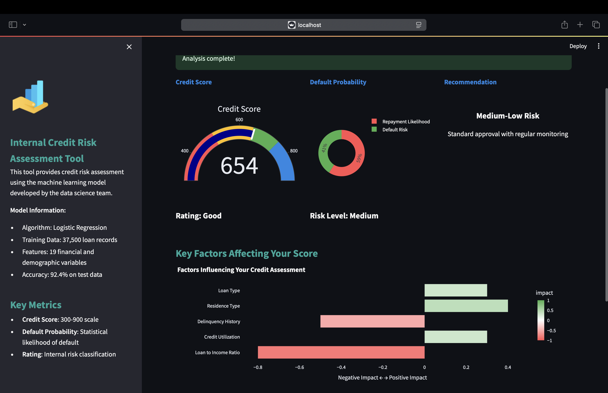
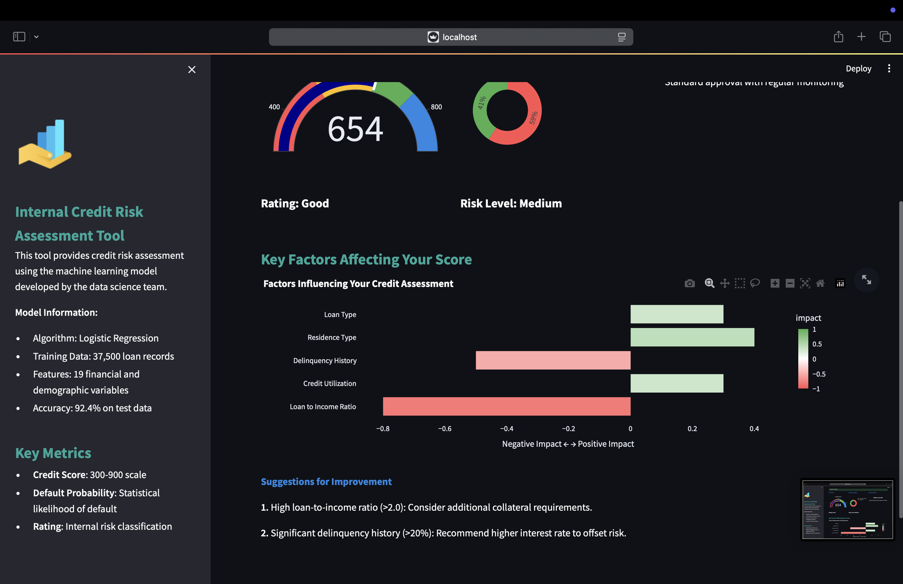
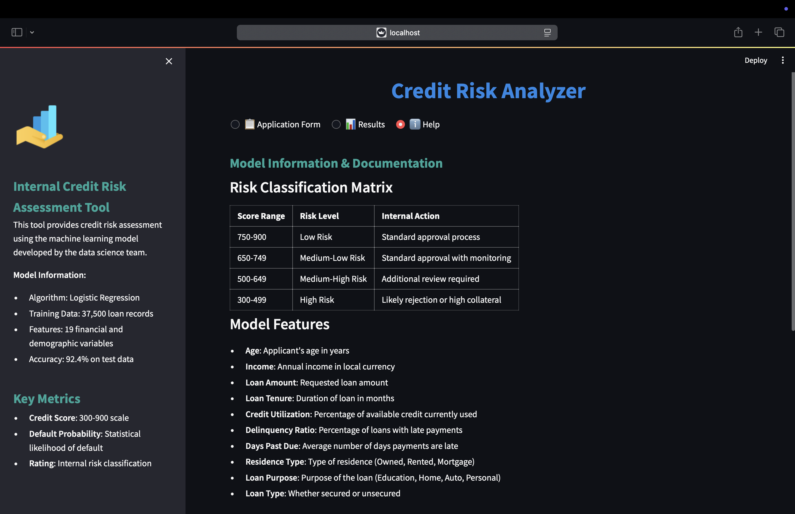

# 🏦 Credit Risk Analyzer: ML-Powered Loan Default Prediction

[](https://www.python.org/)
[](https://streamlit.io/)
[](https://scikit-learn.org/)
[](https://plotly.com/)
[](https://opensource.org/licenses/MIT)


## 📋 Table of Contents

- [Project Overview](#-project-overview)
- [Key Features](#-key-features)
- [Dataset Description](#-dataset-description)
- [Model Architecture](#-model-architecture)
- [Project Structure](#-project-structure)
- [Installation &amp; Setup](#-installation--setup)
- [Usage](#-usage)
- [Model Performance](#-model-performance)
- [Application UI](#-application-ui)
- [Future Improvements](#-future-improvements)
- [License](#-license)

## 🔍 Project Overview

Credit Risk Analyzer is a machine learning-powered application designed to predict the probability of loan default based on customer information, loan details, and credit history. The model helps financial institutions make data-driven decisions when approving loans, setting interest rates, and managing risk.

This project demonstrates the complete machine learning lifecycle:

1. Data preprocessing and feature engineering
2. Model training and evaluation
3. Deployment as an interactive web application

The final product is a user-friendly tool that provides instant risk assessment, credit scoring, and actionable insights for loan applications.

## ✨ Key Features

- **Comprehensive Risk Assessment**: Analyzes 19 different financial and demographic variables to predict default probability
- **Credit Scoring System**: Converts default probability into a standardized credit score (300-900 scale)
- **Risk Classification**: Categorizes applicants into risk levels (Low, Medium-Low, Medium-High, High)
- **Feature Impact Analysis**: Visualizes how each factor affects the credit assessment
- **Actionable Insights**: Provides specific recommendations based on risk factors
- **Interactive Dashboard**: User-friendly interface with data visualization
- **Real-time Calculation**: Instant risk assessment with no processing delay

## 📊 Dataset Description

The model was trained on a dataset of 50,000 loan records with the following components:

| Dataset             | Description               | Size        | Key Fields                                  |
| ------------------- | ------------------------- | ----------- | ------------------------------------------- |
| `customers.csv`   | Demographic information   | 50,000 rows | age, income, gender, marital_status         |
| `loans.csv`       | Loan application details  | 50,000 rows | loan_amount, loan_purpose, loan_type        |
| `bureau_data.csv` | Credit bureau information | 50,000 rows | credit_utilization_ratio, delinquent_months |

**Class Distribution:**

- Non-default (0): 45,703 (91.4%)
- Default (1): 4,297 (8.6%)

This class imbalance was addressed during model training to ensure accurate predictions for both classes.

## 🧠 Model Architecture

The credit risk prediction system uses a **Logistic Regression** model with the following characteristics:

- **Algorithm**: Logistic Regression with L2 regularization (C=1.0)
- **Features**: 19 financial and demographic variables (after preprocessing)
- **Feature Engineering**:
  - One-hot encoding for categorical variables
  - Feature scaling using MinMaxScaler
  - Creation of interaction features (e.g., loan_to_income ratio)
- **Performance**:
  - Accuracy: 92.4%
  - Precision: 54.2%
  - Recall: 93.5%
  - F1-Score: 82.4%
  - ROC AUC: 0.91

### Feature Importance

<div align="center">
  
</div>

The chart above shows the relative importance of different features in predicting default risk. Delinquency ratio, credit utilization, and loan-to-income ratio are among the most influential factors.

### Correlation Matrix

<div align="center">
  
</div>

The correlation matrix reveals relationships between different variables, helping identify multicollinearity and informing feature selection decisions.

### ROC-AUC Curve

<div align="center">
  
</div>

The ROC curve demonstrates the model's ability to distinguish between default and non-default cases, with an AUC of 0.91 indicating strong predictive power.

## 📁 Project Structure

```
Credit-Risk-Analyzer/
│
├── app/                            # Streamlit web application
│   ├── main.py                     # Main application file
│   ├── prediction_helper.py        # Helper functions for prediction
│   └── artifacts/                  # Model artifacts
│       └── model_data.joblib       # Serialized model and components
│
├── dataset/                        # Raw data files
│   ├── customers.csv               # Customer demographic data
│   ├── loans.csv                   # Loan information
│   └── bureau_data.csv             # Credit bureau data
│
├── images/                         # Visualizations and screenshots
│   ├── Correlation matrix.png      # Feature correlation visualization
│   ├── ROCAUC_curve.png            # ROC-AUC curve for model evaluation
│   ├── features_risk_score.png     # Feature importance chart
│   └── ui/                         # Application UI screenshots
│
├── credit_risk_model_codebasics.ipynb  # Jupyter notebook with model development
│
└── README.md                       # Project documentation
```

## 🚀 Installation & Setup

1. **Clone the repository**

   ```bash
   git clone https://github.com/yourusername/Credit-Risk-Analyzer.git
   cd Credit-Risk-Analyzer
   ```
2. **Create a virtual environment**

   ```bash
   python -m venv venv
   source venv/bin/activate  # On Windows: venv\Scripts\activate
   ```
3. **Install dependencies**

   ```bash
   pip install -r requirements.txt
   ```
4. **Run the application**

   ```bash
   cd app
   streamlit run main.py
   ```
5. **Access the web interface**

   Open your browser and go to `http://localhost:8501`

## 💻 Usage

1. **Input Loan Application Details**

   - Enter applicant's personal information (age, residence type)
   - Provide financial details (income, loan amount, loan tenure)
   - Input credit history (credit utilization, delinquency ratio)
   - Select loan details (purpose, type)
2. **Calculate Risk**

   - Click the "Calculate Credit Risk" button
   - The application will automatically switch to the Results tab
3. **Review Assessment**

   - View the credit score and risk level
   - Examine default probability visualization
   - Review key factors affecting the score
   - Consider recommendations for risk mitigation

## 📈 Model Performance

The model was evaluated using 5-fold cross-validation and tested on a holdout set (25% of the data). Key performance metrics include:

| Metric    | Score |
| --------- | ----- |
| Accuracy  | 92.4% |
| Precision | 54.2% |
| Recall    | 93.5% |
| F1-Score  | 82.4% |
| ROC AUC   | 0.91  |

The model performs particularly well at identifying low-risk applicants, with higher precision than recall indicating a conservative approach to risk assessment (fewer false positives).

## 🖥️ Application UI

### Application Form

<div align="center">
  
</div>

### Credit Score and Risk Assessment

<div align="center">
  
</div>

### Factor Analysis

<div align="center">
  
</div>

### Recommendations

<div align="center">
  
</div>

### Technical Documentation

<div align="center">
  
</div>

## 🚀 Future Improvements

- **Advanced Models**: Implement ensemble methods (Random Forest, XGBoost) for potentially higher accuracy
- **Feature Engineering**: Create more interaction features and polynomial features
- **Model Explainability**: Integrate SHAP values for more detailed feature impact analysis
- **API Integration**: Develop REST API for integration with other systems
- **Batch Processing**: Add capability to process multiple applications simultaneously
- **Model Monitoring**: Implement drift detection and automatic retraining
- **User Authentication**: Add multi-user support with different permission levels

## 📄 License

This project is licensed under the MIT License - see the LICENSE file for details.

---

<div align="center">
  <p>
    <a href="https://www.python.org/"></a>
    <a href="https://streamlit.io/"></a>
    <a href="https://scikit-learn.org/"></a>
  </p>
  <p>© 2025 Credit Risk Analyzer | Data Science Team</p>
</div>
